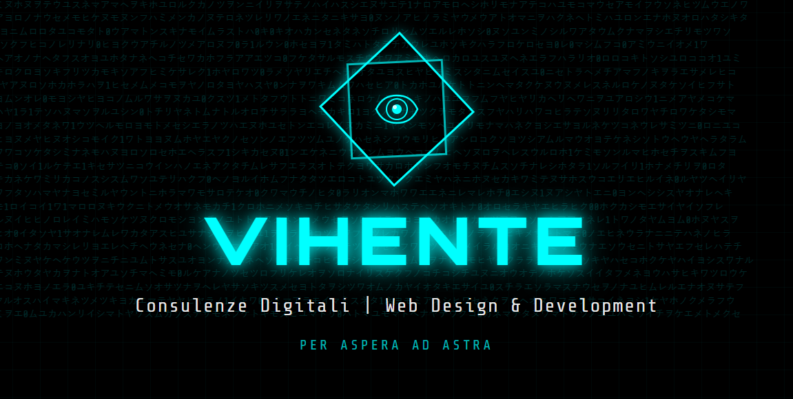

# 🌐 VIHENTE - Consulenze Digitali

<div align="center">

  

  **Portfolio e Landing Page Cyberpunk per Consulenze Digitali**

  [](https://rio-chico-devs.github.io/vihente-app/)
  []()
  []()
  []()

</div>

---

## 📖 Descrizione

VIHENTE è una landing page moderna e professionale per consulenze digitali, sviluppata con React e Vite. Il progetto offre un'esperienza utente immersiva con tema cyberpunk, animazioni fluide e un'attenzione particolare alla sicurezza e alle performance.

### ✨ Caratteristiche Principali

- 🎨 **Design Cyberpunk** con animazioni e effetti visivi accattivanti
- 🚀 **Performance Ottimizzate** con lazy loading e code splitting
- 🔒 **Sicurezza Avanzata** con CSP, HSTS e sanitizzazione input
- ♿ **Accessibilità** WCAG 2.1 compliant
- 📱 **Responsive Design** ottimizzato per tutti i dispositivi
- 🌙 **Dual Theme** (Light/Dark mode)
- 🍪 **Cookie Consent** conforme GDPR
- 🎯 **SEO Optimized** con meta tags e structured data
- 📊 **Error Boundary** per gestione errori robusta

---

## 🛠️ Tech Stack

### Core
- **React 19.1.1** - UI Library
- **Vite 7.1.7** - Build tool & Dev server
- **React Router 7.9.6** - Client-side routing

### Styling & Animation
- **Framer Motion 12.23.24** - Animazioni avanzate
- **Custom CSS** - Styling cyberpunk personalizzato
- **PostCSS & Autoprefixer** - Cross-browser compatibility

### Utilities
- **Validator 13.15.15** - Validazione e sanitizzazione input
- **DOMPurify 3.3.0** - XSS protection
- **Vanilla Cookie Consent 3.1.0** - GDPR compliance

### Development Tools
- **ESLint 9.36.0** - Code quality & linting
- **Vite Plugin React** - Fast Refresh

---

## 📦 Installazione

### Prerequisiti

- Node.js >= 18.0.0
- npm >= 9.0.0

### Setup

```bash
# Clone del repository
git clone https://github.com/Rio-Chico-Devs/vihente-app.git

# Entra nella directory
cd vihente-app

# Installa le dipendenze
npm install

# Avvia il server di sviluppo
npm run dev
```

Il sito sarà disponibile su `http://localhost:3000`

---

## 🔧 Scripts Disponibili

```bash
# Development
npm run dev              # Avvia dev server (porta 3000)

# Build
npm run build           # Build per produzione
npm run preview         # Preview build locale

# Quality
npm run lint            # Esegui ESLint
npm run lint:fix        # Fix automatico problemi ESLint

# Security
npm run security-audit  # Audit sicurezza dipendenze

# Maintenance
npm run clean           # Pulisci dist e cache
npm run build:analyze   # Analizza bundle size
```

---

## 🌍 Environment Variables

Crea un file `.env` nella root del progetto (opzionale):

```env
# API Endpoint (futuro)
VITE_API_URL=https://your-api.com

# Analytics (opzionale)
VITE_ANALYTICS_ID=your-analytics-id

# Mode (automatico)
# VITE_MODE=development|production
```

> **Nota**: Le variabili devono iniziare con `VITE_` per essere accessibili nel frontend.

---

## 📁 Struttura del Progetto

```
vihente-app/
├── public/                  # Assets statici
│   ├── .htaccess           # Configurazione Apache (sicurezza + routing)
│   ├── 404.html            # Fallback per GitHub Pages
│   ├── favicon.svg         # Favicon
│   └── og-image.png        # Open Graph image
│
├── src/
│   ├── assets/             # Risorse (immagini, font, ecc.)
│   ├── components/         # Componenti React
│   │   ├── global/         # Componenti globali (CookieConsent)
│   │   ├── sections/       # Sezioni pagina
│   │   │   ├── Contacts/   # Form contatti
│   │   │   ├── LandingPage/
│   │   │   ├── Portfolio/
│   │   │   └── ...
│   │   ├── ErrorBoundary/  # Error handling
│   │   └── ThemeToggle/    # Toggle tema
│   │
│   ├── contexts/           # React Context (ThemeProvider)
│   ├── utils/              # Utilities (validation.js)
│   ├── App.jsx             # Root component
│   ├── main.jsx            # Entry point
│   └── index.css           # Global styles
│
├── .gitignore
├── eslint.config.js        # ESLint configuration
├── index.html              # HTML template
├── package.json
├── postcss.config.js       # PostCSS config
├── vite.config.js          # Vite configuration
└── README.md
```

---

## 🚀 Deployment

### GitHub Pages (Attuale)

Il sito è deployato automaticamente su GitHub Pages ad ogni push su `main`:

```bash
# Build manuale
npm run build

# Il contenuto di dist/ viene deployato su gh-pages branch
```

**URL Live**: https://rio-chico-devs.github.io/vihente-app/

### Altri Servizi

<details>
<summary><b>Netlify</b></summary>

```bash
# Installa Netlify CLI
npm install -g netlify-cli

# Deploy
netlify deploy --prod
```

**Build settings**:
- Build command: `npm run build`
- Publish directory: `dist`

</details>

<details>
<summary><b>Vercel</b></summary>

```bash
# Installa Vercel CLI
npm install -g vercel

# Deploy
vercel --prod
```

</details>

---

## 🔒 Sicurezza

### Implementazioni di Sicurezza

- ✅ **Content Security Policy (CSP)** configurato in `.htaccess`
- ✅ **HSTS** (HTTP Strict Transport Security) con preload
- ✅ **X-Frame-Options** per protezione clickjacking
- ✅ **X-Content-Type-Options** per MIME sniffing protection
- ✅ **Input Validation** robusta con libreria `validator`
- ✅ **Input Sanitization** con `DOMPurify`
- ✅ **Rate Limiting** lato client per form contatti
- ✅ **HTTPS** enforced tramite HSTS

### Report Vulnerabilità

Se trovi una vulnerabilità, contattaci privatamente a: **security@example.com**

---

## ♿ Accessibilità

Il progetto segue le linee guida **WCAG 2.1 Level AA**:

- ✅ Semantic HTML
- ✅ ARIA labels e roles
- ✅ Keyboard navigation
- ✅ Focus management
- ✅ Color contrast ratios
- ✅ Screen reader compatibility

Test con:
- NVDA (Windows)
- VoiceOver (macOS/iOS)
- JAWS (Windows)

---

## 🧪 Testing

```bash
# Esegui test
npm test

# Test con coverage
npm run test:coverage

# Test in watch mode
npm run test:watch
```

> **Nota**: Suite di testing in implementazione con Vitest.

---

## 📊 Performance

### Lighthouse Scores (Obiettivo)

- Performance: > 90
- Accessibility: > 90
- Best Practices: > 90
- SEO: > 90

### Ottimizzazioni Implementate

- Code splitting con React.lazy()
- Lazy loading componenti
- Tree shaking automatico
- Minificazione CSS/JS
- GZIP compression (server-side)
- Browser caching configurato
- Manual chunks per vendor code

---

## 🤝 Contributing

Contributi sono benvenuti! Per favore:

1. Fork del progetto
2. Crea un branch per la feature (`git checkout -b feature/AmazingFeature`)
3. Commit delle modifiche (`git commit -m 'Add some AmazingFeature'`)
4. Push al branch (`git push origin feature/AmazingFeature`)
5. Apri una Pull Request

### Code Style

- Segui ESLint rules configurate
- Usa Prettier per formattazione (opzionale)
- Commenta codice complesso
- Scrivi commit messages descrittivi

---

## 📝 License

**UNLICENSED** - Questo progetto è proprietario e non è rilasciato sotto alcuna licenza open source.

© 2025 Rio Chico Devs. Tutti i diritti riservati.

---

## 👨‍💻 Autore

**Rio Chico Devs**

- Website: [VIHENTE](https://rio-chico-devs.github.io/vihente-app/)
- GitHub: [@Rio-Chico-Devs](https://github.com/Rio-Chico-Devs)

---

## 🙏 Acknowledgments

- [React](https://react.dev/)
- [Vite](https://vitejs.dev/)
- [Framer Motion](https://www.framer.com/motion/)
- [Validator.js](https://github.com/validatorjs/validator.js)
- Font: Share Tech Mono, Orbitron, Electrolize

---

## 📈 Roadmap

- [ ] Implementazione backend API per form contatti
- [ ] Setup testing suite completo (Vitest)
- [ ] Migrazione a TypeScript
- [ ] Implementazione analytics
- [ ] Integrazione CMS (Strapi/Contentful)
- [ ] Blog section
- [ ] Multi-language support (i18n)
- [ ] PWA support
- [ ] Storybook per componenti

---

<div align="center">

  **⭐ Se ti piace questo progetto, lascia una stella! ⭐**

  Made with ❤️ by Rio Chico Devs

</div>
